# UE第三人称射击练习项目

## 1. 项目功能简介

### 1.1 工程打包（安卓）

本项目已经打包好了安卓安装包，您可以在`_Package`文件夹中找到它的压缩文件，解压后可以看到如下4个文件。在系统中安装有`adb`工具的情况下，将手机与电脑连接并打开USB调试模式，双击运行`Install_NetShootGame-armv7.bat`即可进行安装。

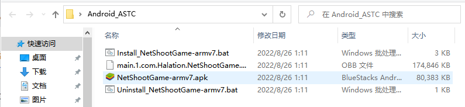

实机演示如下图。

### 1.2 局域网联机会话

主界面如下图所示，点击`开始游戏`即可展开菜单，创建房间即可开始主控游戏，可以单人游玩。

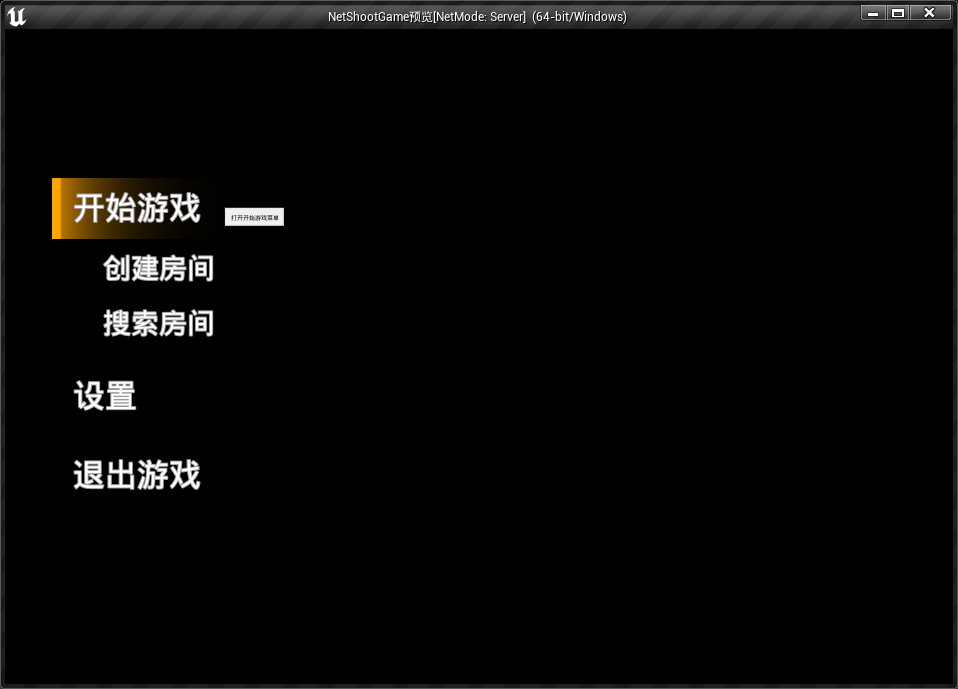

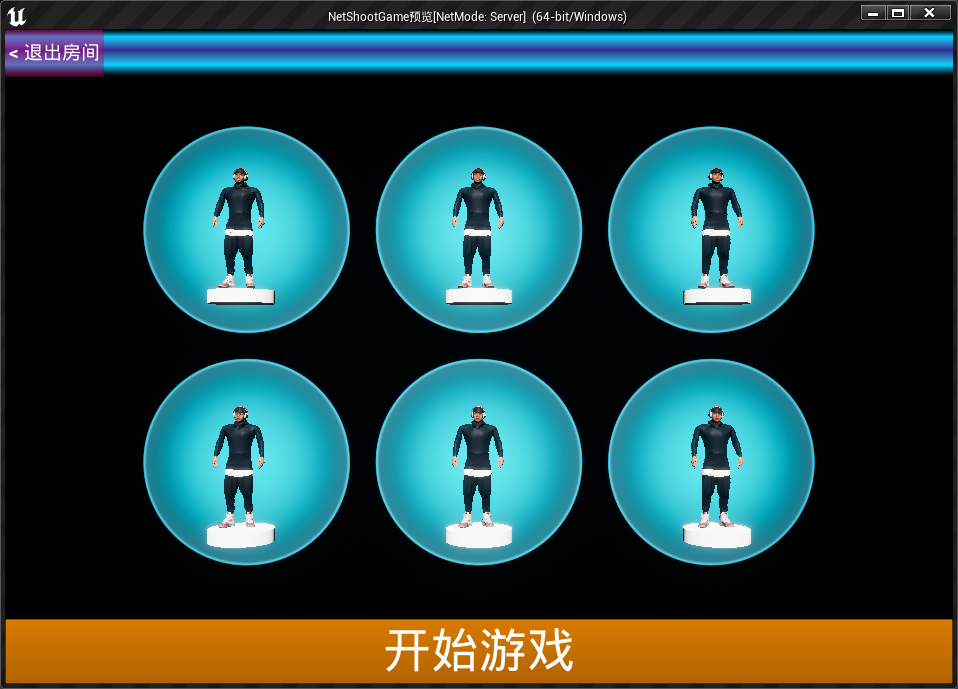

点击`搜索房间`即可打开搜索界面，可以搜索到局域网（同一WIFI或热点）内的其他房主。点击加入游戏下方的按钮，即可加入该房间。

> bug 记录：如果房主已经开始游戏，在人数未满的情况下，也可以加入房间，这时候会出错。本项目暂未对此情况做出处理。

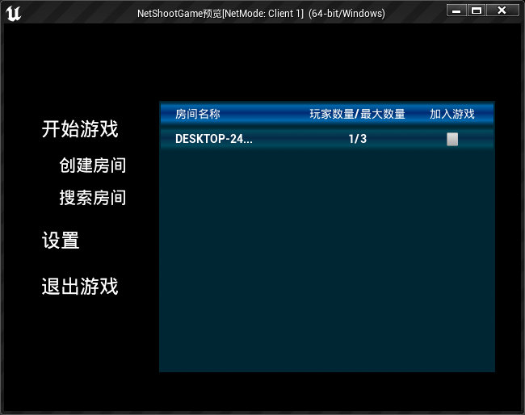

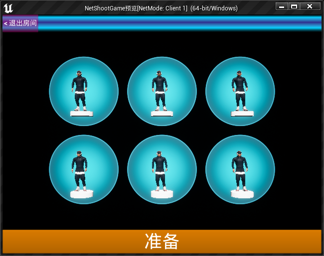

在所有玩家准备后，房主即可开始游戏，进入游戏场景。

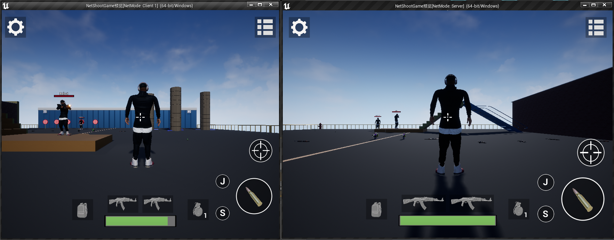

### 1.3 对局内UI说明

除了基本的移动、转视角、瞄准、射击、血条显示等之外，还有一些功能看起来不太明确的按钮，这些按钮的功能如下图所示。

> bug 记录：触控界面（移动和转视角）与 UMG组件（其他按钮）不能同时触发，应该是焦点问题导致的，这使得在手机上的操作及其不流畅。可行的处理方法是将触控界面的按键迁移到UMG中，但需要另外编写代码。

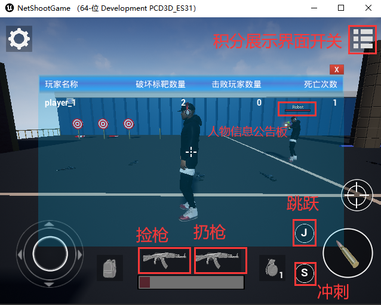

### 1.4  物理模拟效果

子弹击飞标靶的模拟。

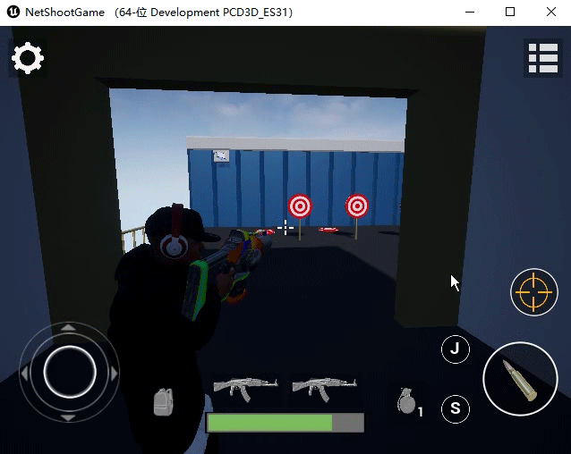

人物被击败时的布娃娃模拟

手雷炸飞标靶的模拟。

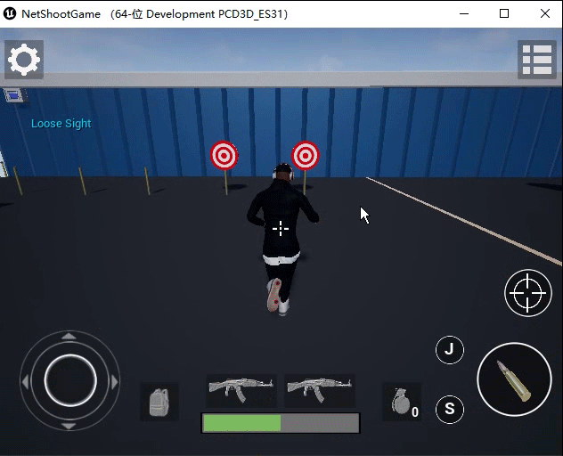

### 1.5 人物动画效果

空手走-跑-冲刺-跳。

持枪走-跑-跳。

瞄准时，脸始终与相机朝向相同，并且可以八向走路，以及抬头低头动画混合（演示gif为2倍速）。

投掷手雷蒙太奇。分三个阶段：拉栓 - 手雷的信号灯在拉栓时有绿变红，代表手雷已经启动准备爆炸；手持 - 如果按住手雷键不放，则会停留在手持状态，用于瞄准；投掷 - 在松开手雷键之后，手雷飞出，以信号灯变红为时间起点，5秒后将爆炸，如果直到爆炸时都没有松手，则会在手上爆炸。

> bug记录：这个Bug还是由于触控界面与UMG不兼容引起的，因此想要进入手持状态，不能使用移动和转视角功能。（如果是PC端则无此问题）

腿部IK，可以站在台阶上。

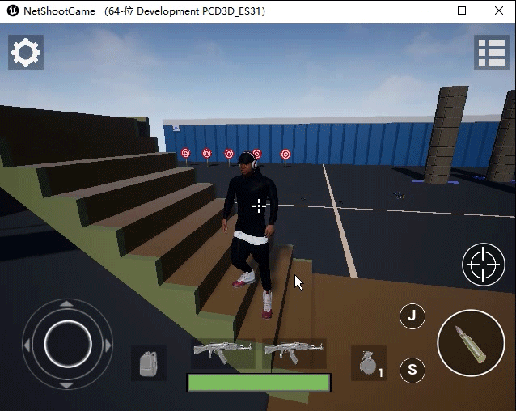

### 1.6 枪械库系统

游戏中拥有四种种类不同的枪，这些枪均由同一个Actor生成，通过读取表格来赋予每个枪不同的外观和属性，因此可以基于此任意扩展枪械种类。

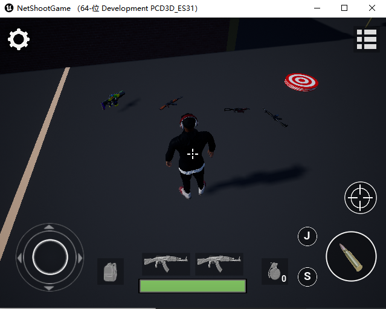

武器类型的配置文件存储在`Content/Configs`下，如下图。目前属性较少，当然之后也可以扩展出武器伤害、武器射击范围等属性。

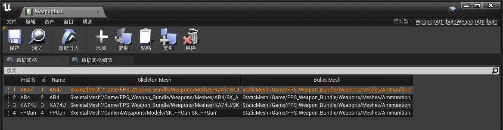

### 1.7 枪械特殊效果

枪械的特殊材质，随时间流动的颜色。

开火时有粒子特效，以及有聚光灯补光。

在瞄准敌人时，准星中心会变为红色。

### 1.8 AI机器人

AI 出生时，由于手上没有枪，因此在场景中寻找枪支并捡起。

在携带枪支的情况下，如果没有发现敌人（玩家），则随机巡逻，如果发现了敌人，则向敌人附近位置移动（EQS），在距离敌人较近时开始射击。

当敌人逃跑时，触发再追击和再射击。

## 2. 待后续更新